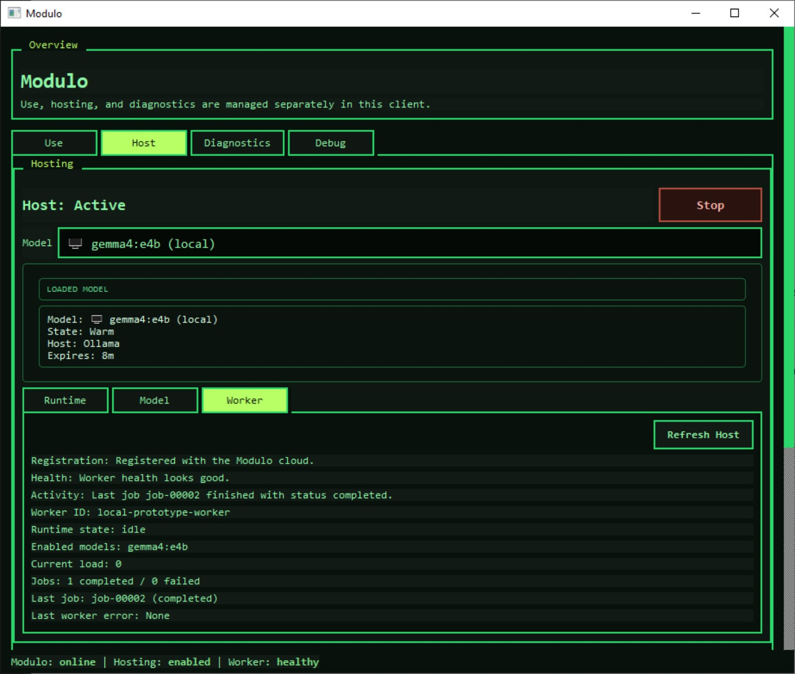
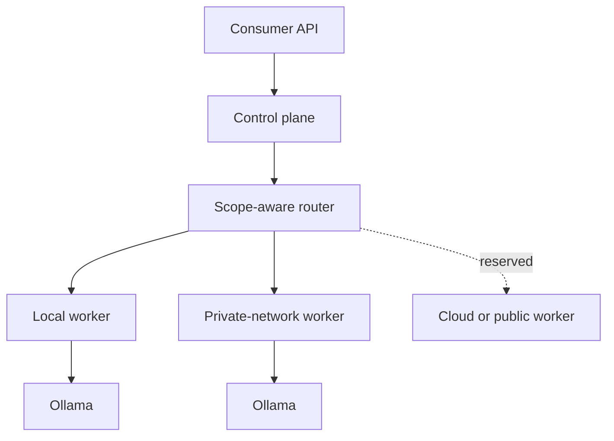

# Modulo

**Route inference across machines you already own.**

Modulo is an experimental distributed inference fabric. It coordinates model capacity across local and private-network machines, then routes each request according to exact model availability, execution scope, worker health, capacity, and runtime confidence.

The current implementation uses [Ollama](https://ollama.com/) as its first execution backend and exposes both Ollama-shaped and OpenAI-compatible consumer APIs. Modulo is the coordination layer around inference; it is not a model runtime and does not replace Ollama.

> [!WARNING]
> **Alpha software for trusted environments.** Modulo does not yet provide authentication, authorization, encrypted transport, persistent control-plane storage, or hostile-worker isolation. Do not expose the current server directly to the public Internet or route sensitive data through machines you do not trust. See [Security](./SECURITY.md).



*The current Windows engineering client hosting a warm `gemma4:e4b` model through Ollama, with the worker registered, healthy, and idle after a completed job.*

## What works today

- centrally coordinated registration, heartbeat, claim, completion, failure, and unregister lifecycle for workers
- real Ollama-backed execution on another machine, plus a stub executor for transport-only testing
- exact-model, scope-aware routing across `local`, `private`, `public`, and `cloud` scopes
- health, capacity, confidence, success-rate, timeout-rate, and headroom-aware worker selection
- private-network isolation through `private_network_id`
- buffered and streaming execution
- Ollama-shaped `GET /api/tags` and `POST /api/chat`
- OpenAI-compatible `GET /v1/models` and `POST /v1/chat/completions`
- route traces that record eligible workers, rejection reasons, selection, retries, and final status
- short-lived buyer-to-worker continuity leases to reduce avoidable cold-path churn
- desktop control surface for using, hosting, mounting, and diagnosing Modulo
- Continue (VS Code) mounting with explicit backup and rollback metadata

`Public` and `Cloud` exist in the scope and policy model, but the demonstrated multi-machine path is currently the trusted `Private` scope. The registry, job queue, leases, and traces are in memory.

## System shape



The boundaries are deliberate:

| Package | Responsibility |
| --- | --- |
| `modulo.client` | Onboarding, supervision, local configuration, consumer mounts, user-visible state |
| `modulo.worker` | Heartbeats, job claims, execution, result/failure reporting, Ollama adapter |
| `modulo.cloud` | API ingress, registry, routing, job lifecycle, retries, continuity, route traces |
| `modulo.common` | Contracts, model catalog, and policy shared across runtime boundaries |

The worker reports facts; the control plane makes routing decisions. The client does not quietly become a second router.

Read [the architecture guide](./docs/architecture.md) and [routing guide](./docs/routing.md) for the deeper design.

## Why Modulo when Ollama already exists?

Ollama runs models on a machine and provides an API to that runtime. Modulo starts where that boundary ends: coordinating multiple runtimes and deciding where a request should execute.

| Ollama | Modulo |
| --- | --- |
| Loads and runs a model | Discovers and advertises available capacity |
| Executes a request locally | Routes a request to an eligible worker |
| Manages the local model runtime | Tracks distributed worker health and load |
| Streams model output | Carries streams across the worker/control-plane boundary |
| Exposes one runtime API | Presents compatible ingress over a pool of runtimes |

Ollama is Modulo's first executor. The `WorkerExecutor` protocol leaves room for other runtimes without moving execution concerns into the router.

## Quick start

Requirements:

- Windows 11 is the current tested client target
- Python 3.11 or newer
- Ollama only for real model execution; the stub proof does not require it

Create an environment and install the package:

```powershell
git clone https://github.com/SEsquieu/Modulo.git
cd Modulo
py -3.11 -m venv .venv
.\.venv\Scripts\Activate.ps1
python -m pip install --upgrade pip
python -m pip install -e .
```

For the complete two-machine proof, including a no-model stub path and real Ollama execution, follow [docs/quickstart.md](./docs/quickstart.md).

### Run the in-process prototype

```powershell
python -m modulo.prototype
```

This exercises the control plane, client supervision, HTTP ingress, worker transport, execution, and response path in one process.

### Run the desktop control surface

```powershell
python -m pip install -e ".[gui]"
python -m modulo.gui_app
```

The current PySide application is an engineering/proving surface, not a polished installer-backed desktop release.

## Minimal private-network proof

On the machine acting as the control plane:

```powershell
python -m modulo.cloud.server --host 0.0.0.0 --port 8000
```

On a second trusted machine:

```powershell
python -m modulo.worker.bridge_runner `
  --modulo-url http://CONTROL_PLANE_IP:8000 `
  --worker-id worker-laptop `
  --model gemma4:e2b `
  --scope private `
  --private-network-id home-lab `
  --stub-response "hello from the remote worker"
```

Then send a request to the control plane from a third terminal:

```powershell
$body = @{
  model = "gemma4:e2b"
  messages = @(@{ role = "user"; content = "hello" })
  stream = $false
  scope = "private"
  private_network_id = "home-lab"
} | ConvertTo-Json -Depth 5

Invoke-RestMethod `
  -Method Post `
  -Uri http://CONTROL_PLANE_IP:8000/api/chat `
  -ContentType "application/json" `
  -Body $body
```

This is intentionally a trusted-network development proof. `0.0.0.0` makes the service reachable on every interface; it does not make the service safe for Internet exposure.

## Routing in one pass

For a request, the router:

1. resolves the requested execution scope;
2. filters workers by kind, health, scope/private-network membership, exact model availability, exclusions, and capacity;
3. scores eligible workers using model confidence, recent success rate, timeout rate, and available concurrency;
4. records the selection and every filtered-worker reason in a route trace;
5. may prefer a still-eligible worker from a short-lived buyer/model continuity lease;
6. can use exact-model cloud fallback only when current policy permits it.

Modulo does not silently substitute a different model in the v1 policy.

## API surface

Consumer-facing:

- `GET /api/tags`
- `POST /api/chat`
- `GET /v1/models`
- `POST /v1/chat/completions`
- `GET /api/platform/status`
- `GET /api/platform/trace/latest`

Worker-facing:

- `POST /worker/register`
- `POST /worker/unregister`
- `POST /worker/heartbeat`
- `POST /worker/jobs/claim`
- `POST /worker/jobs/{job_id}/result`
- `POST /worker/jobs/{job_id}/fail`

These routes currently use unauthenticated JSON over HTTP. That is an explicit alpha limitation.

## Tests

```powershell
python -m unittest discover -s tests -v
```

The suite currently contains 132 tests covering routing, worker transport and execution, HTTP ingress, client/worker integration, local state, Ollama discovery, private-network flow, the GUI controller, and the prototype harness. CI runs on Windows because the current client/local-state contract intentionally includes Windows path behavior.

## Project status

Modulo is a portfolio-grade engineering alpha, not a production service.

Implemented and demonstrated:

- local in-process end-to-end execution
- real cross-machine private-scope execution
- a hosted tunnel proof across separate physical networks
- real Ollama execution and streaming
- OpenAI-compatible consumer mounting through Continue

Known limitations:

- no authentication or authorization
- no TLS termination inside Modulo
- in-memory registry, jobs, leases, and traces
- no adversarial worker isolation or sandboxing
- no stable protocol/version compatibility guarantee
- no packaged installer or background service lifecycle
- `Public` and `Cloud` scopes are architectural/reserved surfaces, not a production marketplace
- Windows is the only current tested client target

See [docs/project-status.md](./docs/project-status.md) for the release boundary,
[docs/release-checklist.md](./docs/release-checklist.md) for the remaining
publication gates, and [docs/roadmap.md](./docs/roadmap.md) for development
history and future work.

## Documentation

Start here:

- [Quick start](./docs/quickstart.md)
- [Architecture](./docs/architecture.md)
- [Routing](./docs/routing.md)
- [Project status](./docs/project-status.md)
- [Public release checklist](./docs/release-checklist.md)
- [Security model](./SECURITY.md)
- [Documentation index](./docs/README.md)

The repository retains detailed design notes and completed roadmaps because they show how the system evolved. They are supporting history, not all current product promises.

## Contributing

Issues and focused pull requests are welcome. Read [CONTRIBUTING.md](./CONTRIBUTING.md) before changing contracts or runtime boundaries.

## License

Licensed under the [Apache License 2.0](./LICENSE).
